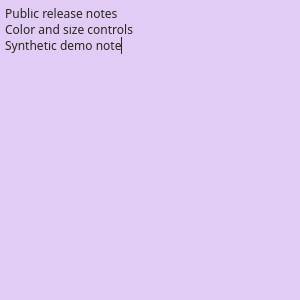
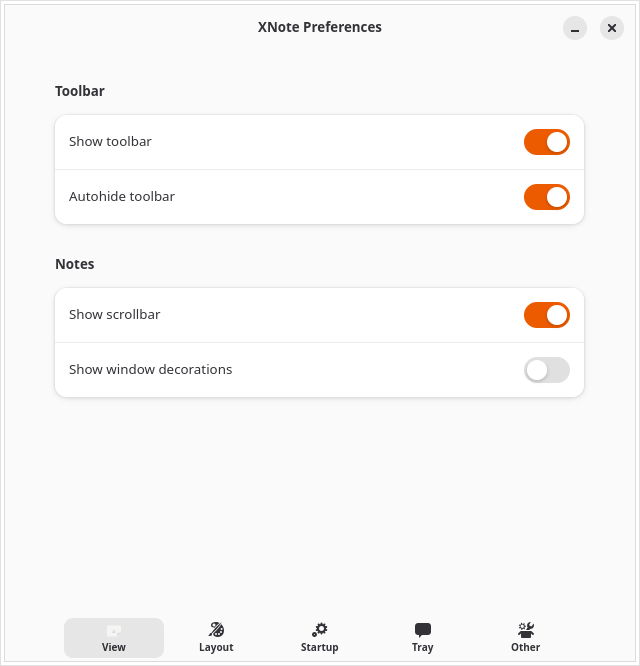
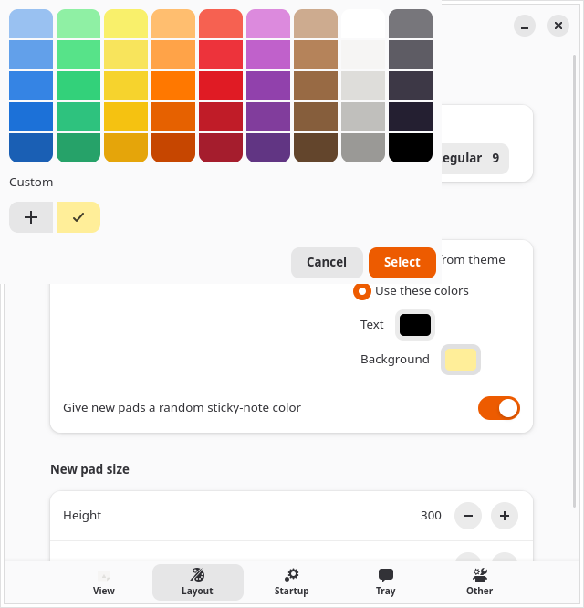
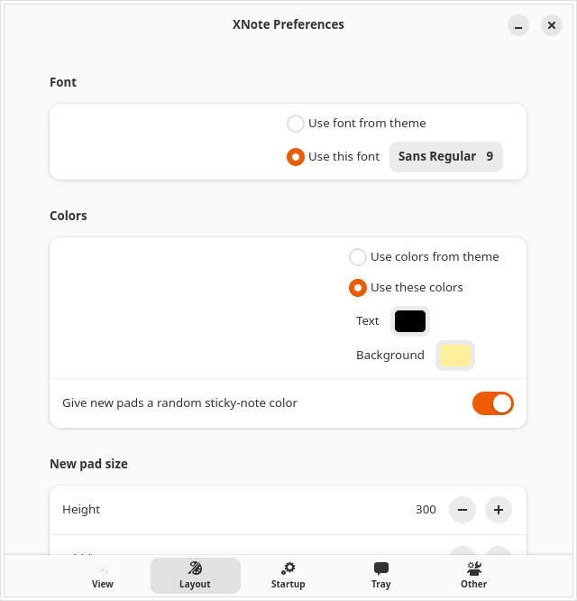

# XNote

XNote is a GTK 4/libadwaita sticky-note application for Linux. It keeps each
note in an independent window, saves changes automatically, provides a
StatusNotifierItem tray menu, and can create encrypted local and off-device
recovery snapshots.

XNote is derived from Xpad 5.8.0 and is now a native Wayland application. The
fork preserves Xpad's focus on small, durable notes while modernizing the
desktop integration for current GNOME systems.

## Features

- Multiple independently styled sticky-note windows.
- Automatic, fault-tolerant local saves under `~/.config/xnote`.
- GTK 4 and libadwaita interface with native Wayland support.
- Optional StatusNotifierItem tray menu.
- Search, formatting, configurable toolbars, and per-note colors.
- Optional end-to-end encrypted backup and recovery through a filesystem path
  or an `rclone` remote.
- Optional companion [XNote Placement extension](https://github.com/spencercnorton/xnote-placement)
  for restoring workspace and monitor placement on GNOME Shell.

## Screenshots

These captures use a fresh, isolated profile with synthetic sample text; they
contain no personal notes or desktop data.






The short animations show the color picker applying a new swatch and the note
growing and shrinking from its resize grip.




## Requirements

XNote is tested on Ubuntu 26.04 with GNOME Shell 50. Building it requires:

- GTK 4.10 or newer
- libadwaita 1.4 or newer
- GtkSourceView 5
- GLib/GIO 2.66 or newer
- Pango and GdkPixbuf development files
- Autoconf, Automake, Libtool, Gettext, and a C compiler
- Go 1.26.8 or newer only when building `xnote-cloud-backup` (older releases
  contain a security flaw in the archive parser used during restore)

Other recent Linux distributions should work when they provide compatible
libraries. XNote does not directly link against X11 libraries.

## Build and install

On Ubuntu, install the development dependencies:

```sh
sudo apt install build-essential autoconf automake libtool intltool gettext \
  autopoint pkg-config autoconf-archive libgtk-4-dev libadwaita-1-dev \
  libgtksourceview-5-dev libglib2.0-dev libpango1.0-dev \
  libgdk-pixbuf-2.0-dev
```

To include the encrypted-backup helper, install a Go 1.26.8-or-newer
toolchain. The checked-in installer is the same checksummed Go 1.26.8 archive
used for release builds (it installs under `/opt` and needs root there):

```sh
sudo ./ci/install-go-toolchain.sh
export PATH="/opt/xnote-go-1.26.8/bin:$PATH"
go version
```

Without a suitable `go` executable, the desktop application still builds but
`xnote-cloud-backup` is omitted. An older Go fails closed; the build never
downloads a replacement toolchain or module dependencies.

Then build and install:

```sh
NOCONFIGURE=1 ./autogen.sh
./configure --prefix=/usr
make -j"$(nproc)"
sudo make install
```

Run `xnote` to start the application. Existing Xpad notes under
`~/.config/xpad` are migrated to `~/.config/xnote` on first launch when the
XNote directory does not already exist.

## Note data and privacy

Live notes are plaintext files under `~/.config/xnote`. Protect that directory
with the same care as the notes themselves. XNote does not send note contents
over the network.

The optional `xnote-cloud-backup` helper creates authenticated encrypted
snapshots under `~/.local/share/xnote-backup`. A configured storage provider
can still observe metadata such as device name, timestamps, file sizes, item
count, and backup cadence. See `man xnote-cloud-backup` before enabling remote
backups, and keep the generated recovery code somewhere separate from the
computer.

Backup is opt-in. Initialise it and verify a manual backup before enabling the
hourly user timer:

```sh
xnote-cloud-backup init
xnote-cloud-backup backup
systemctl --user enable --now xnote-cloud-backup.timer
```

## Development

```sh
make check
cd cloud-helper && go test -mod=vendor ./...
```

The Wayland smoke test requires a headless Weston compositor; CI runs it
against the installed build tree. Bugs and feature requests belong in the
[GitHub issue tracker](https://github.com/spencercnorton/xnote/issues).

## Provenance and license

XNote is a fork of [Xpad](https://launchpad.net/xpad), based on its public
development tree. See `NOTICE` and `AUTHORS` for attribution.

XNote is free software under the GNU General Public License version 3 or, at
your option, any later version. See `COPYING`.
