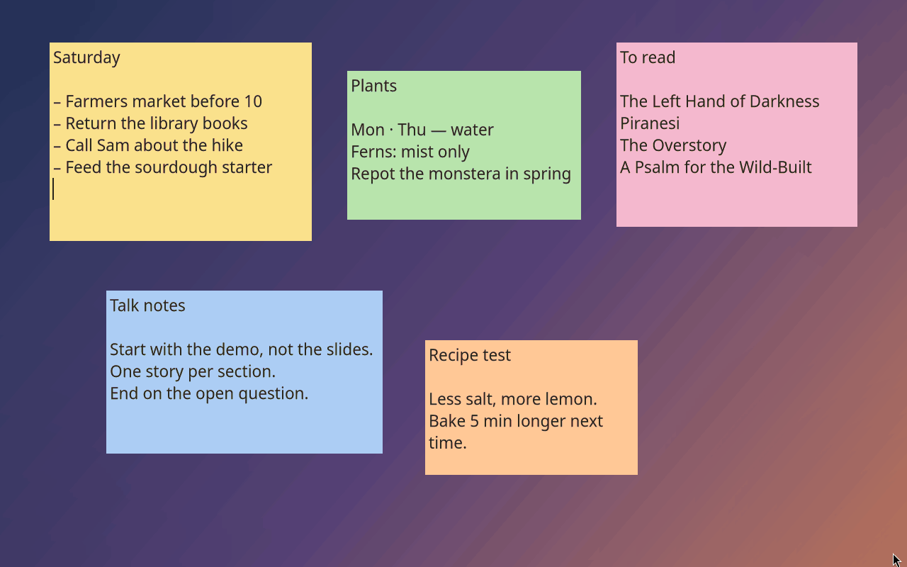
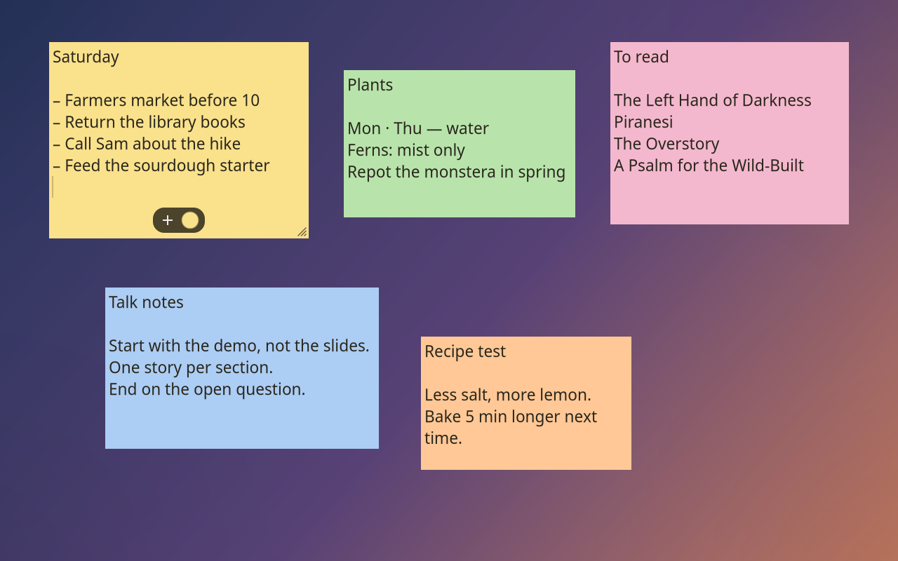
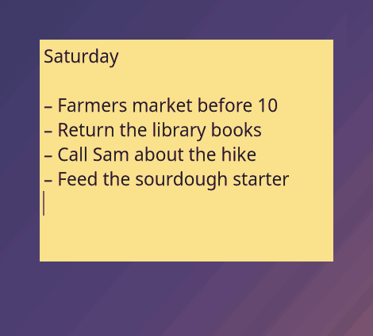

<p align="center">
  
</p>

<h1 align="center">XNote</h1>

<p align="center">
  <strong>Sticky notes that stay on your desktop, and stay yours.</strong><br>
  A native GTK4/libadwaita notes app for GNOME on Wayland, descended from Xpad, with encrypted backup to Dropbox or any rclone remote.
</p>

<p align="center">
  <a href="https://norvitech.com"></a>
  <a href="https://github.com/spencercnorton/xnote/actions/workflows/ci.yml"></a>
  <a href="https://github.com/spencercnorton/xnote/tags"></a>
  <a href="https://apt.globalentry.systems"></a>
  <a href="COPYING"></a>
  <a href="https://buy.stripe.com/8x26oH2U44f65TRe574wM04"></a>
</p>

<p align="center">
  
</p>

The recording and every picture below come from a fresh, isolated profile with invented notes; nothing personal appears in them.

A note is a small window with your words in it, in the colour you gave it,
where you left it. XNote keeps each one as an independent window, saves every
change as you type, and never sends a byte anywhere unless you ask it to. It
is a GPL-3.0-or-later descendant of Xpad, rebuilt on GTK 4 and libadwaita for
GNOME on Wayland.

## What it does

**Notes, not a notes app.** There is no list to open first: each note is its
own window on the desktop, sized and coloured on its own, with the first line
as its title. Hover a note and a small toolbar appears; move the pointer away
and it is gone again.

<p align="center">
  
</p>

**Everything is a keystroke.** `Ctrl+N` for a new note, `Ctrl+B`/`I`/`U` for
formatting, `Ctrl+F` to search inside a note; hold `Ctrl` and drag to move a
note, `Ctrl` and right-drag to resize it. Right-click for the rest.

<p align="center">
  
</p>

**Colours and fonts, per note or for all of them.** The dot on a hovered
note's toolbar opens a row of swatches — one click and the note changes
colour. The full palette, your own colours and the font live in Preferences,
once for every note or overridden on a single one. New notes can take a
random colour so a cluster reads at a glance.


<p align="center">
  
  
</p>
<p align="center">
  
</p>

**Saved as you type.** Notes live as plain files under `~/.config/xnote`,
written atomically on a four-second tick, so a crash never costs more than
the last few seconds and never corrupts a note.

**Encrypted backup to Dropbox — or anywhere rclone goes — so you never lose a
note.** The optional `xnote-cloud-backup` helper takes an encrypted,
authenticated snapshot of every note (XChaCha20-Poly1305 under a key that
only your passphrase or a one-time recovery code can unwrap) and appends it
as a recovery kit to a Dropbox folder, any of the storage services `rclone`
speaks, or a mounted path; an hourly user timer keeps it current. On a new
machine, `xnote-cloud-backup import latest` and the recovery code bring
everything back. The provider sees ciphertext and metadata — device name,
timestamps, sizes, cadence — never a note.

```bash
rclone config                          # once: a remote called "dropbox" (or any provider)
xnote-cloud-backup init                # passphrase + a recovery code, shown once
xnote-cloud-backup backup              # first snapshot; CLOUD_REMOTE=dropbox:xnote-backup in cloud-backup.conf
systemctl --user enable --now xnote-cloud-backup.timer
```

**Back where you left it.** Wayland forbids an application from placing its
own windows, so the companion
[XNote Placement](https://github.com/spencercnorton/xnote-placement) GNOME
Shell extension does it from the compositor side: every note returns to the
position, monitor and workspace it had, on every login. `apt install xnote`
brings it along as a recommendation.

**At home on GNOME.** Native Wayland, libadwaita styling that follows your
theme, and an optional StatusNotifierItem tray menu.

<p align="center">
  
</p>

## Install

### Ubuntu 26.04 — from the APT repository

Add the repository once and XNote updates with everything else:

```bash
curl -fsSL https://apt.globalentry.systems/setup.sh | sudo sh
sudo apt install xnote
```

`setup.sh` installs the signing key and the suite for your release; read it
first if you prefer to do those two steps by hand — it is short. Only `amd64`
packages for 26.04 are published today. The package conflicts with, replaces
and provides `xpad`, and on first launch XNote moves the notes it finds in
`~/.config/xpad` to `~/.config/xnote`. It recommends
`gnome-shell-extension-xnote-placement`, so the placement extension comes
along; enable it once after your next login:

```bash
gnome-extensions enable xnote-placement@spencercnorton.github.io
```

### Other platforms — from source

XNote is tested on Ubuntu 26.04 with GNOME Shell 50. Building it requires:

- GTK 4.10 or newer
- libadwaita 1.5 or newer
- GtkSourceView 5
- GLib/GIO 2.66 or newer
- Pango and GdkPixbuf development files
- Autoconf, Automake, Libtool, Gettext, and a C compiler
- Go 1.26.8 or newer only when building `xnote-cloud-backup` (older releases
  contain a security flaw in the archive parser used during restore)

Other recent Linux distributions should work when they provide compatible
libraries. XNote does not directly link against X11 libraries.

On Ubuntu, install the development dependencies:

```sh
sudo apt install build-essential autoconf automake libtool intltool gettext \
  autopoint pkg-config autoconf-archive libgtk-4-dev libadwaita-1-dev \
  libgtksourceview-5-dev libglib2.0-dev libpango1.0-dev \
  libgdk-pixbuf-2.0-dev
```

To include the encrypted-backup helper, install a Go 1.26.8-or-newer
toolchain. The checked-in installer is the same checksummed Go 1.26.8 archive
used for release builds (it installs under `/opt` and needs root there):

```sh
sudo ./ci/install-go-toolchain.sh
export PATH="/opt/xnote-go-1.26.8/bin:$PATH"
go version
```

Without a suitable `go` executable, the desktop application still builds but
`xnote-cloud-backup` is omitted. An older Go fails closed; the build never
downloads a replacement toolchain or module dependencies.

Then build and install:

```sh
git clone https://github.com/spencercnorton/xnote.git
cd xnote
NOCONFIGURE=1 ./autogen.sh
./configure --prefix=/usr
make -j"$(nproc)"
sudo make install
```

Run `xnote` to start the application. Existing Xpad notes under
`~/.config/xpad` are migrated to `~/.config/xnote` on first launch when the
XNote directory does not already exist.

`scripts/build-deb.sh` builds the same `.deb` the repository publishes, and
the source tarball beside it.

## Documentation

The [user guide](docs/user-guide.md) covers the things the screenshots do not:

- [First run](docs/user-guide.md#first-run) — the first note, autostart and
  where Xpad notes go
- [Notes](docs/user-guide.md#notes) — the toolbar, the context menu, colours,
  fonts, close versus delete
- [Preferences](docs/user-guide.md#preferences) — every page and what each
  setting changes
- [Tray](docs/user-guide.md#tray) — the StatusNotifierItem menu and what
  happens without one
- [Keyboard shortcuts](docs/user-guide.md#keyboard-shortcuts)
- [Command line](docs/user-guide.md#command-line) — driving the running
  instance with `--new`, `--show`, `--hide`, `--toggle`, `--quit`
- [Backup and recovery](docs/user-guide.md#backup-and-recovery) —
  `xnote-cloud-backup` from `init` to `restore` on a new machine
- [Troubleshooting](docs/user-guide.md#troubleshooting)

[docs/development.md](docs/development.md) maps the source tree, the tests
and the release model; [CHANGELOG.md](CHANGELOG.md) lists every release. The
man pages `xnote(1)` and `xnote-cloud-backup(1)` install with the package
(their roff source is in `doc/`). Placement on Wayland is the
[XNote Placement](https://github.com/spencercnorton/xnote-placement) extension's job;
its README explains how.

## Where your data lives

| Path | Purpose |
|---|---|
| `~/.config/xnote/` | Live notes, in plain text: one `content-*` (the words, with formatting tags) and one `info-*` (size, colour, font) per note; `default-style` holds Preferences; `cloud-backup.conf` configures the backup helper; `server` is the socket a running instance listens on. Honours `$XDG_CONFIG_HOME`. |
| `~/.config/autostart/xnote.desktop` | A symlink, created and removed by Preferences → Startup → "Start XNote automatically after login" |
| `~/.local/share/xnote-backup/` | The backup helper's state: `keyfile.json` (the master key, wrapped by your passphrase and again by the recovery code), `head.json`, `snapshots/`, `remote-status.json`, `backup.lock`. Honours `$XDG_DATA_HOME`. |
| `<CLOUD_REMOTE>/<device>/kits/<snapshot-id>/` | Off-box recovery kits, one per backup, append-only; the helper never deletes remote history |
| `xnote-cloud-backup.timer`, `xnote-cloud-backup.service` | systemd user units installed by the package, disabled until you enable them; the timer runs `xnote-cloud-backup sync` hourly |

Nothing leaves the machine unless you configure a backup remote; then only
encrypted recovery kits do, and the provider can observe their metadata
(device name, timestamps, sizes, item count, cadence) but never a note.
Live notes are plain text under `~/.config/xnote` — protect that directory
with the same care as the notes themselves, and keep the recovery code
somewhere separate from the computer.

## Contributing and support

- Bugs and feature requests: [open an issue](https://github.com/spencercnorton/xnote/issues/new/choose). Questions: [Discussions](https://github.com/spencercnorton/xnote/discussions).
- Security reports: [private vulnerability reporting](https://github.com/spencercnorton/xnote/security/advisories/new) — see [SECURITY.md](SECURITY.md). There is no e-mail address; that is deliberate.
- Pull requests are welcome; read [CONTRIBUTING.md](CONTRIBUTING.md) first — this repository is a release mirror, and accepted changes ship in the next tagged release.
- If XNote saves you time, you can [support its development](https://buy.stripe.com/8x26oH2U44f65TRe574wM04).

## Development

```bash
make check                                                                # what CI runs: the GLib unit tests
cd cloud-helper && GOFLAGS=-mod=vendor GOPROXY=off GOTOOLCHAIN=local go test ./...   # the backup helper
dbus-run-session -- tests/wayland-smoke.sh /usr/bin/xnote                 # end to end, under a headless Weston
python3 tests/public-check.py                                             # what every public release must satisfy
```

`./configure --enable-debug=most` builds with `-Wall -Werror`, as CI does;
[docs/development.md](docs/development.md) maps the tree.

## Licence

[GPL-3.0-or-later](COPYING) © Spencer Norton

XNote is a descendant of [Xpad](https://launchpad.net/xpad), forked from its
development tree after the 5.8 release, and inherits its GPL-3.0-or-later
licence. The public history keeps every upstream commit up to the
[baseline commit](https://git.launchpad.net/xpad/commit/?id=637c7b51f1b09a28553a926f594f626d363c526a)
— which is why the contributor list shows Xpad's authors — and everything
after it is XNote; see the
[comparison](https://github.com/spencercnorton/xnote/compare/637c7b51f1b09a28553a926f594f626d363c526a...main).
[NOTICE](NOTICE) and [AUTHORS](AUTHORS) carry attribution; the BinReloc code
in `src/prefix.c` and `src/prefix.h` is LGPL-3.0-or-later
([src/COPYING.LESSER](src/COPYING.LESSER)).

---

<p align="center">
  <a href="https://norvitech.com"></a>
</p>

<p align="center">
  <a href="https://github.com/spencercnorton/helios">Helios</a> ·
  <a href="https://github.com/spencercnorton/bitagent">BitAgent</a> ·
  <a href="https://github.com/spencercnorton/xnote">XNote</a> ·
  <a href="https://github.com/spencercnorton/xnote-placement">XNote Placement</a> ·
  <a href="https://norvitech.com">norvitech.com</a>
</p>
