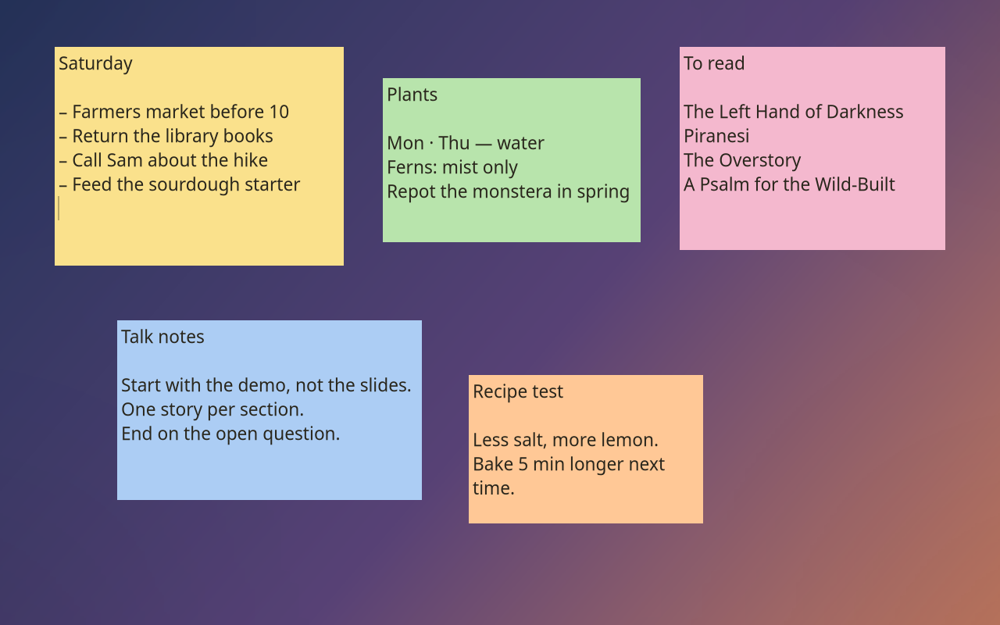
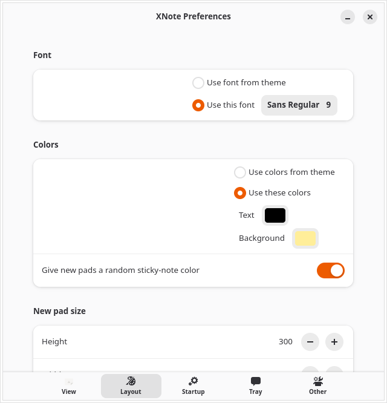

# XNote deployment and operations

XNote is a native GTK4 sticky-note application. Live notes are local plaintext;
optional cloud recovery kits are encrypted. Window placement on GNOME Wayland
is handled by the separate XNote Placement extension.

## Install and verify

The published APT package targets Ubuntu 26.04 on amd64 and replaces the old
xpad package. Back up existing notes before the first migration.

For a manual GitHub install, use v3.2.2 or newer: these Debian packages are
built and install-tested on Ubuntu 26.04, including a real Wayland smoke test.
Download the `.deb`, `source.tar.gz` and `SHA256SUMS.txt` from the same
[release](https://github.com/spencercnorton/xnote/releases) into an empty directory:

```bash
sha256sum --check SHA256SUMS.txt
sudo apt install ./xnote_3.2.2_amd64.deb
xnote --version
```

The v3.2.1 asset was built on Ubuntu 24.04. GitHub installs are versioned manual
updates; the signed APT feed publishes on its own schedule. Use the APT route
below for managed upgrades and keep a separate backup of your notes:

```bash
curl -fsSL https://apt.globalentry.systems/setup.sh -o /tmp/norvitech-apt-setup.sh
less /tmp/norvitech-apt-setup.sh
sudo sh /tmp/norvitech-apt-setup.sh
sudo apt install xnote
xnote --version
xnote
```

Create an invented test note, change its color, close and reopen the app.
Confirm text persists and the tray menu works if AppIndicator is installed.
Use the companion extension's instructions when verifying position, monitor
and workspace restoration; ordinary Wayland clients cannot place windows.



## Configure the application

Preferences controls font, colors, default size, toolbar, scrollbars and
window decorations. A note can override its own appearance. Data is in
`~/.config/xnote`, including note content and per-note state. Treat this whole
directory as private. The app saves atomically on a four-second tick; it is
not a substitute for an off-machine backup.



## Set up encrypted backup

Install rclone if using a supported remote provider. Configure a remote named
`dropbox`, or use your own remote name and set `CLOUD_REMOTE` accordingly.

```bash
rclone config
xnote-cloud-backup init
# Edit ~/.config/xnote/cloud-backup.conf:
# CLOUD_REMOTE=dropbox:xnote-backup
xnote-cloud-backup backup
xnote-cloud-backup status
xnote-cloud-backup remote-list
systemctl --user enable --now xnote-cloud-backup.timer
```

Initialization prints a recovery code once. Store it separately from your
passphrase and backup target. A successful local snapshot is not proof of a
successful remote upload: check status and confirm a complete remote kit.
The provider sees device names, timestamps, sizes and cadence, but not note
contents. Use a non-identifying `CLOUD_DEVICE` label if needed.

## Rehearse recovery

Use a disposable account or VM. Never rehearse over your current live notes.
Configure access to the remote, then:

```bash
xnote-cloud-backup import latest
xnote-cloud-backup unlock --recovery
# Close XNote before restoring a snapshot.
xnote-cloud-backup restore latest
```

Import validates a kit and installs local recovery state; it does not itself
restore live notes. Unlock the imported key explicitly, then restore while
XNote is closed. Inspect the recovered notes in the disposable environment.
Without the passphrase or recovery code, encrypted kits cannot be recovered.

## Upgrades and troubleshooting

Back up notes before upgrading; verify version, save/reopen, placement and
remote backup afterward. Preserve the previous package and a matching data
backup when testing rollback.

| Symptom | Check and next action |
|---|---|
| Notes return in the wrong position | Verify the placement extension and its Shell compatibility. |
| Backup fails as uninitialized | Run init and preserve the one-time recovery code. |
| Local backup succeeds, remote fails | Check remote configuration, provider authorization and helper status. |
| Imported snapshot cannot be opened | Unlock the imported key with passphrase or recovery code. |
| Tray is missing | Check the AppIndicator extension; notes can still run without the tray. |

Do not upload note directories, recovery codes, rclone configuration or
complete logs to a public issue. Consult `man xnote-cloud-backup` for command
semantics, snapshot retention and force-operation safeguards.
